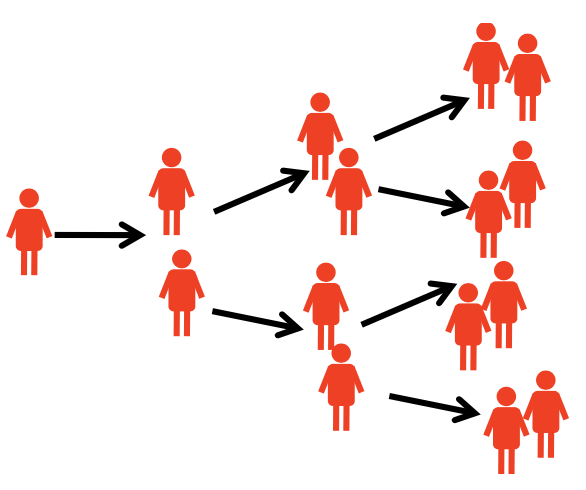
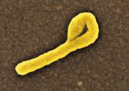
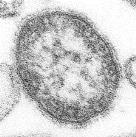
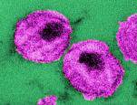
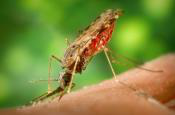
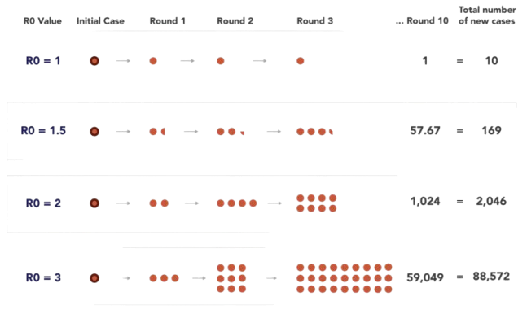
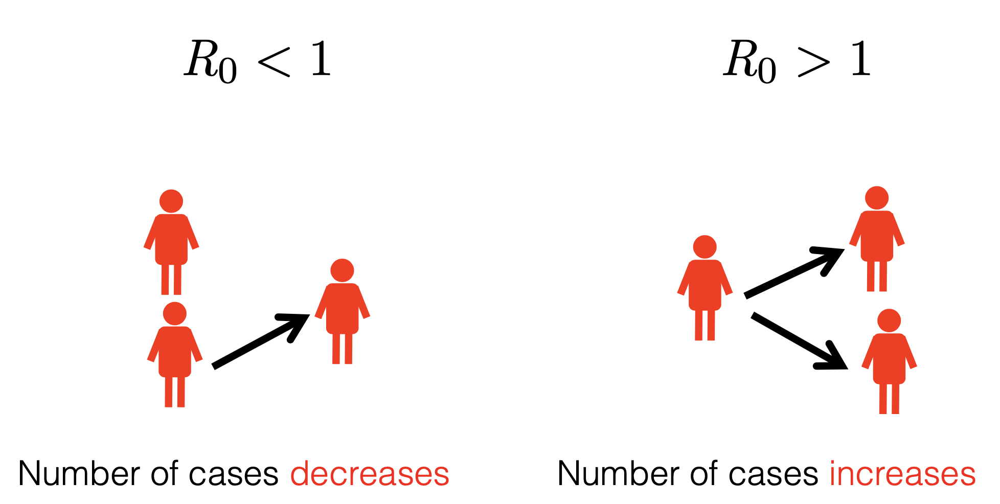

## About Me {.smaller}

:::{.columns}

::: {.column width="70%"}
-   Asst Prof, Dept of CFM \@ AIIMS Bibinagar

 

:::{.fragment}
-   Domain Expertise:
    -   Public Health Data Science
    -   Spatial Epidemiology
    -   Infectious Disease Modeling
    -   R Educator

:::

:::

::: {.column width="30%"}

:::

:::

 

:::{.fragment}
- Trained in Modern Modeling Techniques \@ LSHTM, UK
- Member of R Epidemics Consortium (RECon), Imperial College, London, UK
- COVID-19 Testing Data — ICMR
:::

## About Us

::: fragment
**Team**

-   Prof. Biju Soman, Professor, SCTIMST, Trivandrum
-   Dr. Adrija Roy, PhD Scholar, SCTIMST, Trivandrum
:::

::: fragment
**Training**

-   Basic Epi Course \@ IISc, Bangalore (5 Days)
-   Spatial Epi Summer School \@ IIT, Bombay (3–4 Days)
-   GIS Short Course \@ CUG (5 Days)
-   Data Science for Public Health \@ University of Oslo (3 Workshops, Hybrid)
:::

## Agenda for Today {.smaller}

| Time        | Session                                         |
|-------------|-------------------------------------------------|
| 10:00–11:00 | **1. Foundations** |
| 11:00–11:15 | Tea                                             |
| 11:15–12:15 | **2. Just Enough R** |
| 12:15–13:15 | **3. Compartmental Models** |
| 13:15–14:15 | Lunch                                           |
| 14:15–15:15 | **4. Scenario Modelling**                       |
| 15:15–15:30 | Tea                                             |
| 15:30–16:30 | **5. Putting it all Together**                |
| 16:30–17:00 | Q&A and wrap-up                                 |

## Moments in History {.smaller}

::: incremental
- **Smallpox variolation (1760s)**   Swiss mathematician Daniel Bernoulli modeled the risks and benefits of inoculating against smallpox, considered the first mathematical model of disease spread (universal inoculation would increase life expectancy from 26 years to 29 years). 

-   **Smallpox eradication (1967–77)**   herd immunity threshold \~85% guided WHO's surveillance-and-containment strategy.

- **Ebola Vaccine Trial in Guinea (2014–16)**   "ring vaccination trial" (the rVSV-ZEBOV vaccine study), simulated that by immediately tracing contacts of a new index case, the transmission chain could be interrupted .

:::

## What is a Model?

> A simplified representation of a complex phenomenon.

  

::: fragment

:::

<!-- ::: fragment -->
<!-- > A simplified description, especially a mathematical one, of a system or process, to assist calculations and predictions. — Oxford English Dictionary -->

<!-- ::: -->

::: fragment
> All models are wrong, but some are useful.   — George E. P. Box
:::

## Why Model?

::: incremental
1.  **Understand transmission** — why does measles cycle every 2–3 years?

 

2.  **Assess control** — what % vaccination breaks transmission? <!-- `v = 1 − 1/R₀` -->

 

3.  **Predict** — if we don't act, what happens in 2 weeks?
:::

## The Reproduction Number (R~0~)

:::{.fragment}
> Average number of secondary infectious persons resulting from one infectious person introduced into a totally susceptible population.

:::

:::{.columns}

:::{.column width='50%'}
:::{.fragment}
The number of secondary cases an infectious person generates.
:::
:::

:::{.column width='50%'}
:::{.fragment}

:::
:::

:::

## Rank these Diseases by R~0~ 

::::: columns
::: {.column width="25%"}
{width="100%"}

**Measles**
:::

::: {.column width="25%"}
{width="100%"}

**Malaria**
:::

::: {.column width="25%"}
{width="100%"}

**HIV**
:::

::: {.column width="25%"}
{width="100%"}

**Ebola**
:::
:::::

## Empirical R~0~ Ranges 

| Disease | R~0~ range | Setting                                   |
|---------|-----------:|-------------------------------------------|
| Malaria |      5–100 | Highly variable; strong vector dependence |
| Measles |      12–18 | Pre-vaccination, high-density populations |
| HIV     |        2–5 | Sexual transmission networks              |
| Ebola   |    1.5–2.5 | Close-contact outbreaks                   |

::: fragment
R~0~ tracks **transmissibility**, not "scariness" or lethality.
:::

::: notes
Reveal one row at a time. Discuss why HIV's R0 exceeds Ebola's.
:::

## What does R~0~ depend on?

:::{.incremental}
1. The number of contacts a person has per time ($c$) 
2. The probability of transmission given contact ($p$) 
3. The duration of infectiousness, ($D$)
4. The proportion of contacts that are susceptible ($s$)
:::

:::{.fragment}
A simple model would suggest: 
:::

 

:::{.fragment}

$$R_0 = c \times p \times D \times s$$

:::

## R~0~ Depends on Context

Same pathogen, different settings → different R~0~.

::: incremental
-   Measles in 1950s England: R~0~ ≈ 16
-   Measles in modern London: R~e~ near 0 (vaccination)
-   Influenza on a cruise ship vs a low-density rural area
:::

::: fragment
**Modelling is local work,** 
:::

::: fragment
**And, Context Driven!** 
:::

##

##

## R~t~ in One Line

> Today's new cases come from **past cases that are still infectious**, weighted by **how long ago they were infected**.

That weighting = **serial interval** (or generation time).

$$
I_t = R_t \cdot \sum_{s \geq 1} I_{t-s} \cdot w_s
$$

## Glossary {.smaller}

| Term | Plain English |
|---------------------|---------------------------------------------------|
| **R~0~** | Secondary cases from one case in a *fully susceptible* population |
| **R~t~** (R~e~) | Same, but at time `t` in the *real* population (some are immune) |
| **Force of infection (λ)** | Rate at which susceptibles get infected per unit time |
| **Serial interval** | Time between onset in case A and onset in case B (B infected by A) |
| **Generation time** | Time between *infection* of A and *infection* of B by A |
| **Herd immunity** | Indirect protection when enough are immune; threshold = 1 − 1/R~0~ |
|---------------------|---------------------------------------------------|

# Questions?