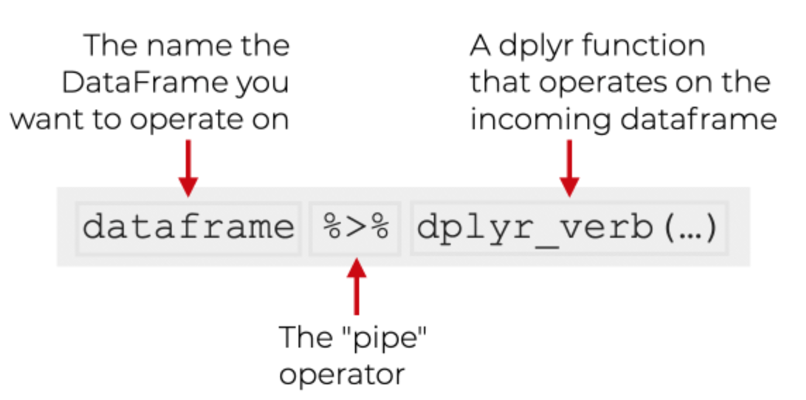
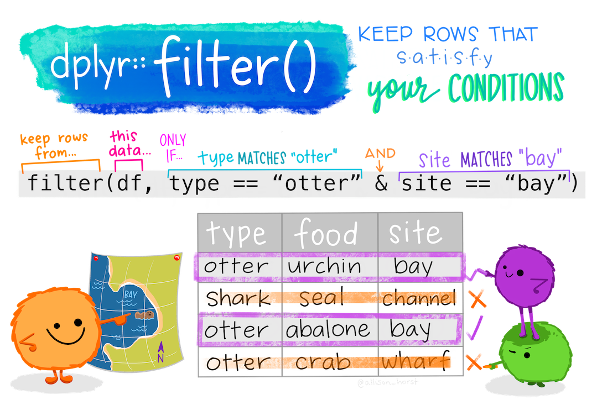
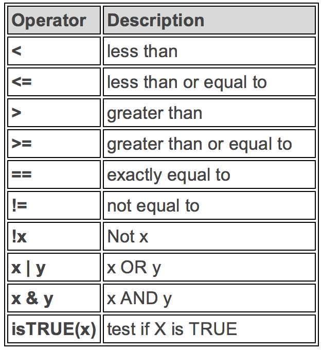
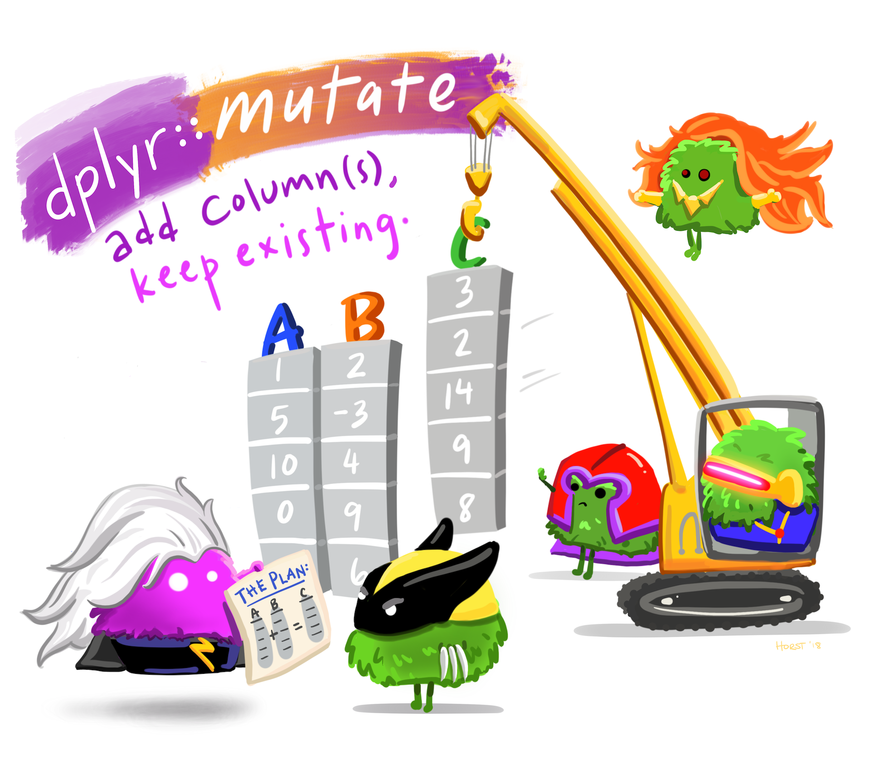

## Why R for IDM?

- **Free and open-source** — everywhere, no licence fees.
- **The IDM ecosystem lives in R** — `deSolve`, `EpiEstim`, `epidemics`, `EpiNow2`, `incidence2`, `outbreaks`, `socialmixr`.
- **Reproducible** — your script *is* your method. Re-run it in five years and get the same numbers.
- **One language for the whole pipeline** — clean → analyse → model → plot → publish.

::: {.notes}
Set the why. Don't compare to Python — that's a distraction.
:::

## RStudio in 4 Panes {.smaller}

| Pane          | What it does                              |
|---------------|-------------------------------------------|
| **Source**    | Your script — write code, save it         |
| **Console**   | R runs here. Output prints here           |
| **Environment** | Objects R knows about right now         |
| **Plots / Help / Files** | Plots, `?docs`, your project files |

Run a line: **Ctrl/Cmd + Enter**.

::: fragment
Common errors:

- *"object not found"* → you didn't run the line that creates it.
- *"could not find function"* → package not loaded.
:::

# Part I: R Basics

## Assignment and Vectors

```{r}
#| eval: false
x <- 5                          # assign 5 to x
x                               # print x  →  [1] 5

ages <- c(25, 30, 35, 40)       # a numeric vector
mean(ages)                      # → 32.5
length(ages)                    # → 4
```

Use `<-` for assignment. `=` works too but `<-` is the convention.
`c()` combines values into a vector — the smallest unit of data in R.

## Functions and Arguments

```{r}
#| eval: false
mean(ages)                      # one positional argument
mean(x = ages, na.rm = TRUE)    # named arguments

# Type ?mean in the console for help
?mean
```

Arguments can be **positional** (in order) or **named** (`name = value`). Named beats positional for clarity — *always name the second argument onward*.

## Data Types {.smaller}

```{r}
#| eval: false
is.numeric(3.14)                # TRUE
is.character("Kerala")          # TRUE
is.logical(TRUE)                # TRUE

# Vectors: same type only
c(1, 2, 3)                      # numeric
c("Kerala", "TN", "AP")         # character
c(TRUE, FALSE, TRUE)            # logical

# Mixed types coerce to character
c(1, "Kerala", TRUE)            # → "1" "Kerala" "TRUE"
```

The four types you'll meet most: **numeric · character · logical · factor**.

## Loading Packages

```{r}
#| eval: false
install.packages("tidyverse")   # one-time, on a new machine

library(tidyverse)              # every R session, before use
library(EpiEstim)
library(here)
```

`install.packages()` is **once**. `library()` is **every session**.
If you see *"could not find function"*, you forgot the `library()` call.

## Subsetting Basics {.smaller}

```{r}
#| eval: false
ages <- c(25, 30, 35, 40)

ages[1]                         # first element            → 25
ages[c(2, 4)]                   # multiple elements        → 30, 40
ages[ages > 30]                 # logical subset           → 35, 40

# Data frames: $ for columns, [] for rows / cols
mtcars$mpg                      # the mpg column
mtcars[1, ]                     # first row, all columns
mtcars[, "mpg"]                 # all rows, mpg column
```

# Part II: Tidyverse Principles

## Tidy Data

::::: columns

::: {.column width="55%"}
**Three rules:**

1. Each **variable** in its own column.
2. Each **observation** in its own row.
3. Each **value** in its own cell.

A line list is tidy data: one row per case, one column per attribute.
:::

::: {.column width="45%"}
| case_id | onset      | gender |
|--------:|------------|--------|
|       1 | 2014-04-01 | F      |
|       2 | 2014-04-03 | M      |
|       3 | 2014-04-04 | F      |
:::

:::::

::: {.notes}
Wickham, H. (2014). *Tidy Data*. JSS. The whole tidyverse is built on this.
:::

## The Pipe Operator

{fig-align="center" width="65%"}

Read `|>` out loud as **"and then…"**.
`x |> f()` is the same as `f(x)`. `x |> f() |> g()` is `g(f(x))`.

::: {.notes}
We use the native pipe `|>` (R 4.1+). The older `%>%` from magrittr behaves almost identically.
:::

## Reading Data

```{r}
#| echo: false
#| message: false

library(tidyverse)

covid <- read_csv(here("data", "covid_india_daily.csv"))
```


```{r}
#| eval: false
library(readr)
library(here)

covid <- read_csv(here("data", "covid_india_daily.csv"))
```

- **`read_csv()`** from `readr` is faster and tidier than base R's `read.csv()` — it returns a tibble.
- **`here()`** builds project-relative paths. Use it instead of absolute paths — your code will work on any machine.

# Part III: The `dplyr` Verbs

## Five Verbs Cover 90% of Data Work {.smaller}

| Verb                       | What it does          |
|----------------------------|-----------------------|
| `filter()`                 | Keep some **rows**    |
| `select()`                 | Keep some **columns** |
| `mutate()`                 | Make new columns      |
| `arrange()`                | Reorder rows          |
| `group_by() + summarise()` | Collapse rows by group |

Combine with the pipe `|>` for readable, sequential transformations.

## `filter()` function - Keeps the Rows

::::: columns

::: {.column width="55%"}
{width="100%"}


:::

::: {.column width="45%"}
```{r}
#| eval: false
covid |>
  filter(daily_confirmed > 100000)

covid |>
  filter(date >= "2021-03-01",
         date <= "2021-06-30")
```

Multiple conditions joined with comma = **AND**. Use `|` for OR.
:::

:::::

## Logical Operators in `filter()`

::::: columns

::: {.column width="40%"}
{width="100%"}
:::

::: {.column width="60%"}
```{r}
#| eval: false
covid |>
  filter(daily_confirmed > 100000)

covid |>
  filter(date == "2021-05-06")

covid |>
  filter(!is.na(daily_confirmed))

covid |>
  filter(date >= "2021-03-01" &
         date <= "2021-06-30")
```
:::

:::::

::: {.notes}
`!is.na()` is the everyday "drop missing" idiom. Worth a 30-second pause.
:::

## `select()` function: Keeps the Columns

```{r}
#| eval: false
covid |> select(date, daily_confirmed)        # keep two columns

covid |> select(-cumulative_confirmed)        # drop one column

covid |> select(starts_with("daily"))         # tidy-select helpers
```

`starts_with()`, `ends_with()`, `contains()`, `matches()` (regex) all work inside `select()`.

## `mutate()` function: Makes New Columns

::::: columns

::: {.column width="55%"}
{width="100%"}

::: {.smaller}
*Illustration © Allison Horst, CC-BY 4.0.*
:::
:::

::: {.column width="45%"}
```{r}
#| eval: false
covid |>
  mutate(
    week  = lubridate::floor_date(date, "week"),
    cases_per_lakh = daily_confirmed / 13800
  )
```

`mutate()` creates new columns or overwrites existing ones.
:::

:::::

## `arrange()` — Reorder Rows

```{r}
#| eval: false
covid |> arrange(daily_confirmed)              # ascending

covid |> arrange(desc(daily_confirmed))        # descending — peak day first

covid |> arrange(date)                         # chronological
```

Default is ascending. Wrap with `desc()` for descending.

## `group_by() + summarise()` — Collapse by Group

```{r}
#| eval: false
covid |>
  mutate(year = lubridate::year(date)) |>
  group_by(year) |>
  summarise(
    total_cases = sum(daily_confirmed, na.rm = TRUE),
    peak_day    = max(daily_confirmed, na.rm = TRUE),
    n_days      = n()
  )
```

The most powerful pattern in dplyr. **Group, then collapse**.
`n()` counts rows in the current group.

# Part C: Plotting with `ggplot2`

## The Grammar of Graphics

A plot is built in **layers**:

::: incremental
1. **Data**: the tibble you're plotting.
2. **Aesthetics**: `aes()` maps columns to position, colour, size.
3. **Geoms**: the visual shapes: `geom_line`, `geom_col`, `geom_point`.
4. **Scales**: how to translate values to pixels (axes, colour palettes).
5. **Facets**: small multiples by a categorical variable.
:::

## A Plot, Built Up 

```{r}
#| eval: false
#| code-line-numbers: "|1|2|3|4|5|6"
covid |>                                                        # <1>
  ggplot(aes(x = date, y = daily_confirmed)) +                  # <2>
  geom_col(fill = "steelblue") +                                # <3>
  scale_y_continuous(labels = scales::comma) +                  # <4>
  facet_wrap(~ lubridate::year(date), scales = "free_y") +      # <5>
  labs(x = NULL, y = "Daily confirmed",                         # <6>
       title = "COVID-19 India — in waves")
```

1. The data — must be a tibble or data frame.
2. `aes()` maps `date` → x-axis, `daily_confirmed` → y-axis.
3. Bars, filled steel blue.
4. Format y-axis with thousand separators.
5. One panel per year. `free_y` lets each year find its own scale.
6. Labels and title.

## The Plot {.smaller}

```{r}
#| eval: true
covid |>                                                        # <1>
  ggplot(aes(x = date, y = daily_confirmed)) +                  # <2>
  geom_col(fill = "steelblue") +                                # <3>
  scale_y_continuous(labels = scales::comma) +                  # <4>
  facet_wrap(~ lubridate::year(date), scales = "free_y") +      # <5>
  labs(x = NULL, y = "Daily confirmed",                         # <6>
       title = "COVID-19 India — three waves")
```

## Common Geoms {.smaller}

| Geom            | Use for…                              |
|-----------------|---------------------------------------|
| `geom_line()`   | Trends over time                      |
| `geom_col()`    | Bars (counts already computed)        |
| `geom_bar()`    | Bars (compute counts from raw data)   |
| `geom_point()`  | Scatter plots                         |
| `geom_histogram()` | Distribution of one numeric variable |
| `geom_boxplot()` | Distribution by group                |
| `geom_smooth()` | Trend line through points             |

# Part E — Putting It Together

## The Line List → Plot Pipeline {.smaller}

```{r}
#| message: false
library(tidyverse)
library(outbreaks)
library(lubridate)

ll <- outbreaks::ebola_sim_clean$linelist |> as_tibble()

ll |>
  filter(!is.na(date_of_onset)) |>
  mutate(month = floor_date(date_of_onset, "month")) |>
  group_by(month, gender) |>
  summarise(cases = n(), .groups = "drop") |>
  ggplot(aes(month, cases, fill = gender)) +
  geom_col(position = "dodge") +
  labs(x = "Month", y = "Cases",
       title = "Ebola simulated outbreak — monthly cases by gender")
```

Five verbs. One pipeline. Read it top-to-bottom as English.

## The "Epi Way" — Two Lines, Same Plot

```{r}
#| message: false
library(incidence2)

inc <- incidence(ll, date_index = "date_of_onset",
                 interval = "week", groups = "gender")
plot(inc)
```

Same idea — three lines instead of seven. Epi packages give you tidy shortcuts for common patterns. **Bridge to R~t~ in Foundations.**

## Activity — Try It Yourself

In your project, open `activity_02_pipeline.R`:

::: incremental
1. Change the grouping in the Ebola pipeline from `gender` to `hospital`.
2. Switch the interval from `"month"` to `"week"`.
3. Change the geom from `geom_col` to `geom_line`.
4. Add a `geom_smooth()` layer to overlay a trend.
:::

::: {.notes}
5 minutes. Pair anyone struggling with a neighbour.
:::

# Part F — Applied: R~t~ from Indian COVID-19 Data

## COVID-19 India — Daily Cases {.smaller}

```{r}
#| message: false
library(tidyverse); library(EpiEstim); library(here)

covid_india <- read_csv(here("data", "covid_india_daily.csv"),
                        show_col_types = FALSE) |>
  transmute(dates = as.Date(date),
            I     = as.integer(daily_confirmed)) |>
  arrange(dates) |>
  filter(!is.na(I))

covid_india |>
  ggplot(aes(dates, I)) +
  geom_col(fill = "steelblue") +
  scale_y_continuous(labels = scales::comma) +
  labs(x = NULL, y = "Daily confirmed cases",
       title = "COVID-19 India — JHU CSSE, 2020-01 to 2023-03")
```

::: {.notes}
Three waves: W1 mid-2020 → Feb 2021; W2 Mar–Jun 2021 (Delta, peak 414k on 2021-05-06); W3 Dec 2021 – Feb 2022 (Omicron).
:::

## Estimate R~t~ Nationally {.smaller}

```{r}
#| eval: false
#| code-line-numbers: "|3-7|3|4|5|6"
# SARS-CoV-2 serial interval (Nishiura et al. 2020): mean 4.7, sd 2.9
rt_fit <- estimate_R(
  incid  = covid_india,                                         # <1>
  method = "parametric_si",                                     # <2>
  config = make_config(list(mean_si = 4.7, std_si = 2.9))       # <3>
)

plot(rt_fit, "R")                                               # <4>
```

1. The data: a tibble with `dates` and `I` (daily incidence). One row per day.
2. `parametric_si` — serial interval is a known parametric distribution (gamma).
3. Mean and SD of the SI in days. Change these and R~t~ shifts.
4. Plot just the R~t~ panel. `plot(rt_fit)` shows all three.

::: fragment
**Above 1** → wave growing. **Below 1** → wave shrinking. Always read the credible interval.
:::

## R~0~ from the Early-Wave Growth Rate {.smaller}

For a quick R~0~ from the **start** of a wave, fit a log-linear model and convert:

```{r}
#| eval: false
#| code-line-numbers: "|1-3|5|6|7|8"
wave2_start <- covid_india |>
  filter(dates >= as.Date("2021-03-01"),
         dates <= as.Date("2021-03-21"))                        # <1>

fit <- glm(I ~ as.numeric(dates), data = wave2_start, family = poisson())  # <2>
r   <- coef(fit)[2]                                             # <3>
Tg  <- 4.7                                                      # <4>
R0_wave2 <- 1 + r * Tg                                          # <5>
R0_wave2
```

1. First 21 days of Wave 2 — Delta growing exponentially before susceptibles deplete.
2. Poisson GLM with a log link. The slope is the **log of the daily growth multiplier**.
3. Pull the slope out as a scalar.
4. Generation time mean (days).
5. Wallinga & Lipsitch (2007): in the early phase, **R~0~ ≈ 1 + r · T~g~**.

## Activity — R~t~ Across Three Waves {.smaller}

Open `activity_02_waves.R`. Three teams, one wave each:

| Team | Wave   | Window (illustrative)   |
|------|--------|-------------------------|
| 1    | Wave 1 | 2020-06-01 → 2020-12-31 |
| 2    | Wave 2 | 2021-03-01 → 2021-06-30 |
| 3    | Wave 3 | 2021-12-15 → 2022-02-28 |

For your wave:

::: incremental
1. Filter the data to the window.
2. Run `estimate_R()` with the SARS-CoV-2 serial interval.
3. Note the **peak R~t~**, **when it crossed 1**, and the **width of the credible interval**.
4. One sentence: *what does this tell you about that wave?*
:::


::: fragment
*If you can read it, you can write it.*
:::
