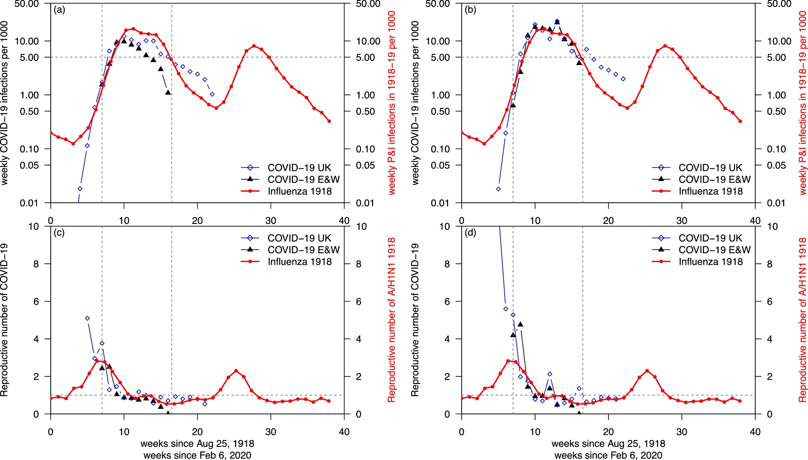
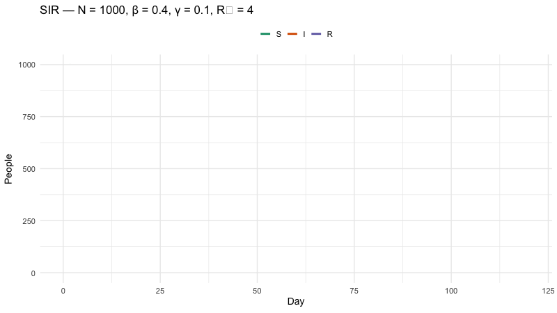
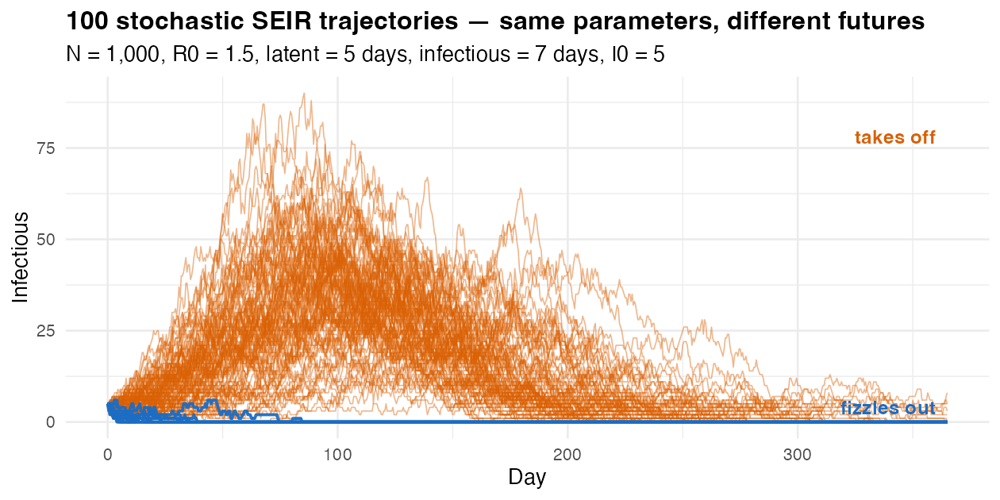

## A Grain of Rice!

:::{.r-stack}

{.fragment width='74%' .center}

{.fragment}

:::

:::{.fragment}
Total Grains: 18,446,744,073,709,551,615

Estimated Mass: ~461,168,602,000 metric tons.
:::

:::{.fragment}
**The Magic of Exponential Growth!**
:::


# Compartmental Models

## Types of Models in IDM {.smaller}

| Axis                            | Choices                                              |
|---------------------------------|------------------------------------------------------|
| **Mechanistic vs statistical**  | Mechanism (SIR) vs pattern fitting (GLM, ARIMA)      |
| **Deterministic vs stochastic** | Same input → same output  vs  same input → distribution |
| **Population vs individual**    | Compartments (counts) vs agents (each person)        |
| **Homogeneous vs structured**   | One pool  vs  age / space / risk groups              |
| **Time**                        | Continuous (ODE) vs discrete (difference eqs, branching) |

##


## Why Compartments?

- Few parameters. Easy to interpret.
- Closed-form intuition for R~0~, herd immunity, final size.
- Same skeleton extends to vaccination, age structure, spatial spread.
- The dashboard at 15:30 sits on top of compartmental thinking.

## Same Shape, Different Disease {.smaller}


{width='100%'}

:::{.fragment}
A 1918 flu epicurve and a COVID-19 wave look strikingly similar.
:::


:::{.fragment}
**Compartmental dynamics are universal.** Three equations recreate this shape.
:::


## SIR: Compartments

```{r}
#| echo: false
#| fig-width: 9
#| fig-height: 3
library(tidyverse); library(grid)

nodes_sir <- tibble(
  name = c("S", "I", "R"),
  x    = c(1, 3, 5),
  y    = 0,
  fill = c("#1b9e77", "#d95f02", "#7570b3")
)
edges_sir <- tibble(
  from_x = c(1, 3), to_x = c(3, 5), y = 0,
  label  = c("β x (I / N)", "γ"),
  sublbl = c("force of infection", "recovery rate"),
  mid_x  = c(2, 4)
)
buf <- 0.36

ggplot() +
  geom_segment(data = edges_sir,
               aes(x = from_x + buf, xend = to_x - buf, y = y, yend = y),
               arrow = arrow(length = unit(10, "pt"), type = "closed"),
               linewidth = 1.1, colour = "grey25") +
  geom_point(data = nodes_sir, aes(x = x, y = y, colour = name), size = 26) +
  geom_text(data = nodes_sir, aes(x = x, y = y, label = name),
            colour = "white", fontface = "bold", size = 9) +
  geom_text(data = edges_sir, aes(x = mid_x, y = 0.42, label = label), size = 6) +
  geom_text(data = edges_sir, aes(x = mid_x, y = -0.45, label = sublbl),
            size = 4, colour = "grey40", fontface = "italic") +
  scale_colour_manual(values = setNames(nodes_sir$fill, nodes_sir$name)) +
  coord_fixed(xlim = c(0.3, 5.7), ylim = c(-0.9, 0.9), clip = "off") +
  theme_void() +
  theme(legend.position = "none", plot.margin = margin(8, 8, 8, 8))
```

Mass-action: $\lambda = \beta \times \frac{I}{N}$ assumes everyone mixes equally.

## SIR: Equations

$$
\begin{aligned}
\frac{dS}{dt} &= -\beta \times S \times \frac{I}{N} \\
\frac{dI}{dt} &= +\beta \times S \times \frac{I}{N} - (\gamma \times I) \\
\frac{dR}{dt} &= +\gamma \times I
\end{aligned}
$$

**R~0~ = β / γ.** 

β = 0.3 / day, 

D = 1/γ = 7 days 

**R~0~ = 2.1**.

## SIR — Code

```{r}
#| code-line-numbers: "|3|4|5-7|11-16"
library(deSolve)

sir_eq <- function(t, y, params) {                              # <1>
  with(as.list(c(y, params)), {                                 # <2>
    dS <- -beta * S * I / N                                     # <3>
    dI <-  beta * S * I / N - gamma * I
    dR <-  gamma * I
    list(c(dS, dI, dR))                                         # <4>
  })
}

out <- ode(                                                     # <5>
  y     = c(S = 1e6 - 10, I = 10, R = 0),
  times = 0:200,
  func  = sir_eq,
  parms = c(beta = 0.3, gamma = 0.1, N = 1e6)
) |> 
  unclass() |> 
  as.data.frame() |> 
  as_tibble()
```

1. The model **is** a function — takes time, state, parameters; returns rates of change.
2. `with(as.list(c(y, params)))` lets us write `S`, `I`, `beta`, `gamma` by name instead of `y["S"]`, `params["beta"]`.
3. The three derivatives — read out loud as one English sentence each (*"susceptibles fall at rate β·S·I/N…"*).
4. `deSolve` expects a list whose first element is the vector of derivatives.
5. `ode()` integrates from t = 0 to t = 200 in steps of 1.


## SIR — Watch It Run 


{fig-align="center" width="100%"}


## SIR — Trajectory {.smaller}

```{r}
#| message: false
#| echo: false
out |>
  pivot_longer(c(S, I, R), names_to = "compartment") |>
  mutate(compartment = factor(compartment, levels = c("S", "I", "R"))) |> 
  ggplot(aes(time, value, colour = compartment)) +
  geom_line(linewidth = 1.2) +
  scale_colour_manual(values = c(S = "#1b9e77", I = "#d95f02", R = "#7570b3")) +
  labs(x = "Day", y = "People", colour = NULL) +
  theme_minimal(base_size = 14)
```

::: {.incremental}
- **S** drains as people get infected.
- **I** rises, peaks, then falls.
- **R** fills in — those who've been through it.
:::


::: {.notes}
Pre-rendered with gganimate. Idea borrowed from F. Gazzelloni's 2023 R-Ladies Rome talk; code regenerated. Let it loop while you talk through the right column.
:::

## Extending SIR to SEIR

```{r}
#| echo: false
#| fig-width: 10
#| fig-height: 3
library(tidyverse); library(grid)

nodes_seir <- tibble(
  name = c("S", "E", "I", "R"),
  x    = c(1, 3, 5, 7),
  y    = 0,
  fill = c("#1b9e77", "#e7298a", "#d95f02", "#7570b3")
)
edges_seir <- tibble(
  from_x = c(1, 3, 5), to_x = c(3, 5, 7), y = 0,
  label  = c("β x (I / N)", "σ", "γ"),
  sublbl = c("force of infection", "incubation rate", "recovery rate"),
  mid_x  = c(2, 4, 6)
)
buf <- 0.36

ggplot() +
  geom_segment(data = edges_seir,
               aes(x = from_x + buf, xend = to_x - buf, y = y, yend = y),
               arrow = arrow(length = unit(10, "pt"), type = "closed"),
               linewidth = 1.1, colour = "grey25") +
  geom_point(data = nodes_seir, aes(x = x, y = y, colour = name), size = 26) +
  geom_text(data = nodes_seir, aes(x = x, y = y, label = name),
            colour = "white", fontface = "bold", size = 9) +
  geom_text(data = edges_seir, aes(x = mid_x, y = 0.42, label = label), size = 6) +
  geom_text(data = edges_seir, aes(x = mid_x, y = -0.45, label = sublbl),
            size = 4, colour = "grey40", fontface = "italic") +
  scale_colour_manual(values = setNames(nodes_seir$fill, nodes_seir$name)) +
  coord_fixed(xlim = c(0.3, 7.7), ylim = c(-0.9, 0.9), clip = "off") +
  theme_void() +
  theme(legend.position = "none", plot.margin = margin(8, 8, 8, 8))
```

**E** = exposed but not yet infectious. Adds a latent period before transmission begins.

## From SIR… {auto-animate="true" auto-animate-easing="ease-in-out"}

$$
\begin{aligned}
\frac{dS}{dt} &= -\beta \cdot S \cdot I / N \\
\frac{dI}{dt} &= +\beta \cdot S \cdot I / N - \gamma \cdot I \\
\frac{dR}{dt} &= +\gamma \cdot I
\end{aligned}
$$

## …to SEIR {auto-animate="true" auto-animate-easing="ease-in-out"}

$$
\begin{aligned}
\frac{dS}{dt} &= -\beta \cdot S \cdot I / N \\
\frac{dE}{dt} &= +\beta \cdot S \cdot I / N - \sigma \cdot E \\
\frac{dI}{dt} &= +\sigma \cdot E - \gamma \cdot I \\
\frac{dR}{dt} &= +\gamma \cdot I
\end{aligned}
$$

One new equation. **σ = 1 / mean latent period.** Latency *delays* the peak — final size barely changes.

## SEIR — Code 

```{r}
#| eval: false
seir_eq <- function(t, y, params) {
  with(as.list(c(y, params)), {
    dS <- -beta * S * I / N
    dE <-  beta * S * I / N - sigma * E                         # <1>
    dI <-  sigma * E - gamma * I                                # <2>
    dR <-  gamma * I
    list(c(dS, dE, dI, dR))                                     # <3>
  })
}
```

1. The new line: people who got infected enter `E` first, *not* `I`.
2. `dI` changes — the source is now `σ · E`, not `β · S · I / N` directly.
3. The state vector grows by one — `dE` is added, in the same order as the initial conditions.

## SIR vs SEIR — Same R~0~, Different Timing

```{r}
#| message: false
#| echo: false
#| fig-width: 9
#| fig-height: 4
library(deSolve)
library(tidyverse)

sir_eq <- function(t, y, p) with(as.list(c(y, p)), {
  list(c(-beta*S*I/N, beta*S*I/N - gamma*I, gamma*I))
})
seir_eq <- function(t, y, p) with(as.list(c(y, p)), {
  list(c(-beta*S*I/N, beta*S*I/N - sigma*E, sigma*E - gamma*I, gamma*I))
})

p_sir  <- c(beta = 0.3, gamma = 0.1, N = 1e6)
p_seir <- c(beta = 0.3, gamma = 0.1, sigma = 1/5, N = 1e6)

sir_out  <- ode(c(S=1e6-10, I=10, R=0),       0:200, sir_eq,  p_sir)  |>
  unclass() |> as.data.frame() |> as_tibble()
seir_out <- ode(c(S=1e6-10, E=0, I=10, R=0),  0:200, seir_eq, p_seir) |>
  unclass() |> as.data.frame() |> as_tibble()

bind_rows(
  sir_out  |> transmute(time, model = "SIR",  I = as.numeric(I)),
  seir_out |> transmute(time, model = "SEIR", I = as.numeric(I))
) |>
  ggplot(aes(time, I, colour = model)) +
  geom_line(linewidth = 1.2) +
  scale_colour_manual(values = c(SIR = "#d95f02", SEIR = "#1b9e77")) +
  labs(x = "Day", y = "Infectious", colour = NULL,
       title = "Same R0 = 3 — latent period delays the SEIR peak") +
  theme_minimal(base_size = 14)
```

## Common Extensions {.smaller}

| Variant            | New mechanism                  | Use when…                                |
|--------------------|--------------------------------|------------------------------------------|
| **SEIRS**          | R → S (waning immunity)        | Endemic respiratory pathogens, repeated waves |
| **SEIRD**          | I → D (deaths)                 | Mortality matters (Ebola, COVID severity)     |
| **SVEIR**          | S → V (vaccinated)             | Vaccination programmes (Session 3)            |
| **MSEIR**          | M = maternal immunity          | Childhood diseases (measles in infants)       |
| **Age-structured** | Compartments per age band      | Heterogeneous mixing (Session 3)              |
| **Metapopulation** | Compartments per location      | Spatial spread between districts/states       |

**Same skeleton** — add boxes, add arrows, add equations.

## SEIRS — Waning Immunity {.smaller}

```{r}
#| echo: false
#| fig-width: 10
#| fig-height: 3.5
library(tidyverse); library(grid)

nodes_seirs <- tibble(
  name = c("S", "E", "I", "R"),
  x    = c(1, 3, 5, 7),
  y    = 0,
  fill = c("#1b9e77", "#e7298a", "#d95f02", "#7570b3")
)
edges_seirs <- tibble(
  from_x = c(1, 3, 5), to_x = c(3, 5, 7), y = 0,
  label  = c("β x (I / N)", "σ", "γ"),
  mid_x  = c(2, 4, 6)
)
buf <- 0.36

ggplot() +
  # forward flow
  geom_segment(data = edges_seirs,
               aes(x = from_x + buf, xend = to_x - buf, y = y, yend = y),
               arrow = arrow(length = unit(10, "pt"), type = "closed"),
               linewidth = 1.1, colour = "grey25") +
  geom_text(data = edges_seirs, aes(x = mid_x, y = 0.32, label = label), size = 5.5) +
  # waning loop: R → S, curving above the row
  annotate("curve",
           x = 7 - buf, xend = 1 + buf, y = 0.25, yend = 0.25,
           curvature = 0.45,
           arrow = arrow(length = unit(10, "pt"), type = "closed"),
           linewidth = 1.1, colour = "#5d519a") +
  annotate("text", x = 4, y = 1.55, label = "ω", size = 9, colour = "#5d519a") +
  annotate("text", x = 4, y = 1.95, label = "waning immunity",
           size = 4, colour = "#5d519a", fontface = "italic") +
  # nodes & labels
  geom_point(data = nodes_seirs, aes(x = x, y = y, colour = name), size = 26) +
  geom_text(data = nodes_seirs, aes(x = x, y = y, label = name),
            colour = "white", fontface = "bold", size = 9) +
  scale_colour_manual(values = setNames(nodes_seirs$fill, nodes_seirs$name)) +
  coord_fixed(xlim = c(0.3, 7.7), ylim = c(-0.7, 2.0), clip = "off") +
  theme_void() +
  theme(legend.position = "none", plot.margin = margin(8, 8, 8, 8))
```

```{r}
#| eval: false
seirs_eq <- function(t, y, params) {
  with(as.list(c(y, params)), {
    dS <- -beta * S * I / N + omega * R                         # <1>
    dE <-  beta * S * I / N - sigma * E
    dI <-  sigma * E - gamma * I
    dR <-  gamma * I - omega * R                                # <2>
    list(c(dS, dE, dI, dR))
  })
}
# omega = 1 / mean duration of immunity
```

1. Recovered people return to `S` at rate `ω` — that's the only new term in `dS`.
2. The mirror term in `dR` keeps the bookkeeping consistent (people leaving `R` are added to `S`).

With ω > 0 the system can settle into **endemic oscillations** — recurrent waves. The engine behind seasonal flu and COVID re-infection patterns.

## SEIRD — Tracking Mortality {.smaller}

```{r}
#| echo: false
#| fig-width: 10
#| fig-height: 4
library(tidyverse); library(grid)

nodes_seird <- tibble(
  name = c("S", "E", "I", "R", "D"),
  x    = c(1, 3, 5, 7, 5),
  y    = c(0, 0, 0, 0, -1.6),
  fill = c("#1b9e77", "#e7298a", "#d95f02", "#7570b3", "#4d4d4d")
)
flow_edges <- tibble(
  from_x = c(1, 3, 5), to_x = c(3, 5, 7), y = 0,
  label  = c("β x (I / N)", "σ", "(1 − μ) x γ"),
  mid_x  = c(2, 4, 6)
)
buf <- 0.36

ggplot() +
  # main S → E → I → R flow
  geom_segment(data = flow_edges,
               aes(x = from_x + buf, xend = to_x - buf, y = y, yend = y),
               arrow = arrow(length = unit(10, "pt"), type = "closed"),
               linewidth = 1.1, colour = "grey25") +
  geom_text(data = flow_edges, aes(x = mid_x, y = 0.4, label = label),
            size = 5.5) +
  # I → D downward branch
  annotate("segment",
           x = 5, xend = 5, y = -buf, yend = -1.6 + buf,
           arrow = arrow(length = unit(10, "pt"), type = "closed"),
           linewidth = 1.1, colour = "grey25") +
  annotate("text", x = 5.25, y = -0.85, label = "μ x γ",
           size = 5.5, hjust = 0) +
  # nodes & labels
  geom_point(data = nodes_seird, aes(x = x, y = y, colour = name), size = 24) +
  geom_text(data = nodes_seird, aes(x = x, y = y, label = name),
            colour = "white", fontface = "bold", size = 8) +
  scale_colour_manual(values = setNames(nodes_seird$fill, nodes_seird$name)) +
  coord_fixed(xlim = c(0.3, 7.7), ylim = c(-2.2, 0.9), clip = "off") +
  theme_void() +
  theme(legend.position = "none", plot.margin = margin(8, 8, 8, 8))
```

The flow out of **I** splits — fraction (1 − μ) recovers to **R**, fraction μ goes to **D** (cumulative deaths). μ = case fatality ratio.

```{r}
#| eval: false
seird_eq <- function(t, y, params) {
  with(as.list(c(y, params)), {
    dS <- -beta * S * I / N
    dE <-  beta * S * I / N - sigma * E
    dI <-  sigma * E - gamma * I
    dR <-  (1 - mu) * gamma * I                                 # <1>
    dD <-  mu * gamma * I                                       # <2>
    list(c(dS, dE, dI, dR, dD))
  })
}
# mu = case fatality ratio
```

1. The flow out of `I` splits — a fraction `(1 − μ)` recovers.
2. The remaining fraction `μ` goes to `D` (cumulative deaths).

$D$ = cumulative deaths. 

## Stochastic Reality {.smaller}

Same R~0~ = 1.5. **Same parameters. Different futures.**

{fig-align="center" width="90%"}

Real outbreaks are noisy, especially when case counts are small. With I~0~ = 5, about 11/100 chains *fizzle out* and never become an outbreak — even though the deterministic model would always predict a wave.


## Group Work {.smaller}

| Group | Disease         | R~0~ | D (days) |
|-------|-----------------|-----:|---------:|
| 1     | Measles-like    | 15   | 8        |
| 2     | Flu-like        | 1.5  | 4        |
| 3     | Ebola-like      | 2    | 10       |
| 4     | COVID-19 like   | 3    | 7        |

For your group:

1. Run the SIR script.
2. Before plotting, try to guess the peak time and final size.
3. Compare prediction to plot.

<br>

**Bonus:**

- Extend to SEIR (σ = 1/5). What changed? What didn't?

## Group Work — Results {.smaller}

```{r}
#| echo: false
#| message: false
#| fig-width: 11
#| fig-height: 6
library(deSolve); library(tidyverse); library(scales)

sir_eq <- function(t, y, params) {
  with(as.list(c(y, params)), {
    dS <- -beta * S * I / N
    dI <-  beta * S * I / N - gamma * I
    dR <-  gamma * I
    list(c(dS, dI, dR))
  })
}

run_sir <- function(R0, D, N = 1e6, I0 = 10, t_end = 365) {
  ode(
    y     = c(S = N - I0, I = I0, R = 0),
    times = 0:t_end,
    func  = sir_eq,
    parms = c(beta = R0 / D, gamma = 1 / D, N = N)
  ) |> unclass() |> as.data.frame() |> as_tibble()
}

groups <- tribble(
  ~group, ~disease,        ~R0,  ~D,
  1,      "Measles-like",   15,   8,
  2,      "Flu-like",       1.5,  4,
  3,      "Ebola-like",     2,    10,
  4,      "COVID-19-like",  3,    7
) |>
  mutate(panel = sprintf("Group %d — %s  (R0 = %g, D = %g days)",
                         group, disease, R0, D))

sims <- groups |>
  mutate(sim = map2(R0, D, run_sir)) |>
  unnest(sim)

answers <- sims |>
  group_by(panel) |>
  summarise(peak_day   = time[which.max(I)],
            final_size = round(max(R)),
            .groups    = "drop") |>
  mutate(lbl = sprintf("Peak day %d\nFinal size %s",
                       peak_day, comma(final_size)))

results <- sims |>
  pivot_longer(c(S, I, R), names_to = "compartment") |>
  mutate(compartment = factor(compartment, levels = c("S", "I", "R")))

ggplot(results, aes(time, value, colour = compartment)) +
  geom_line(linewidth = 0.9) +
  geom_label(data = answers,
             aes(x = 360, y = 1e6, label = lbl),
             hjust = 1, vjust = 1, inherit.aes = FALSE,
             size = 3.6, fontface = "bold",
             label.size = 0, fill = alpha("white", 0.7)) +
  facet_wrap(~ panel, ncol = 2) +
  scale_colour_manual(values = c(S = "#1b9e77", I = "#d95f02", R = "#7570b3")) +
  scale_y_continuous(labels = comma) +
  labs(x = "Day", y = "People", colour = NULL) +
  theme_minimal(base_size = 12) +
  theme(legend.position = "top",
        strip.text = element_text(face = "bold"))
```

**Final size depends on R~0~ alone** — Kermack–McKendrick. Bigger R~0~ → more people infected.
**Peak timing depends on β and γ separately** — Group 3 (longest D) peaks latest, even though its R~0~ is moderate.

