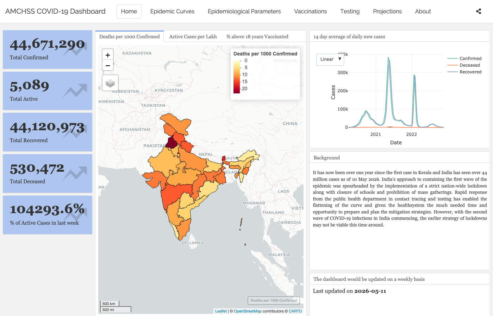
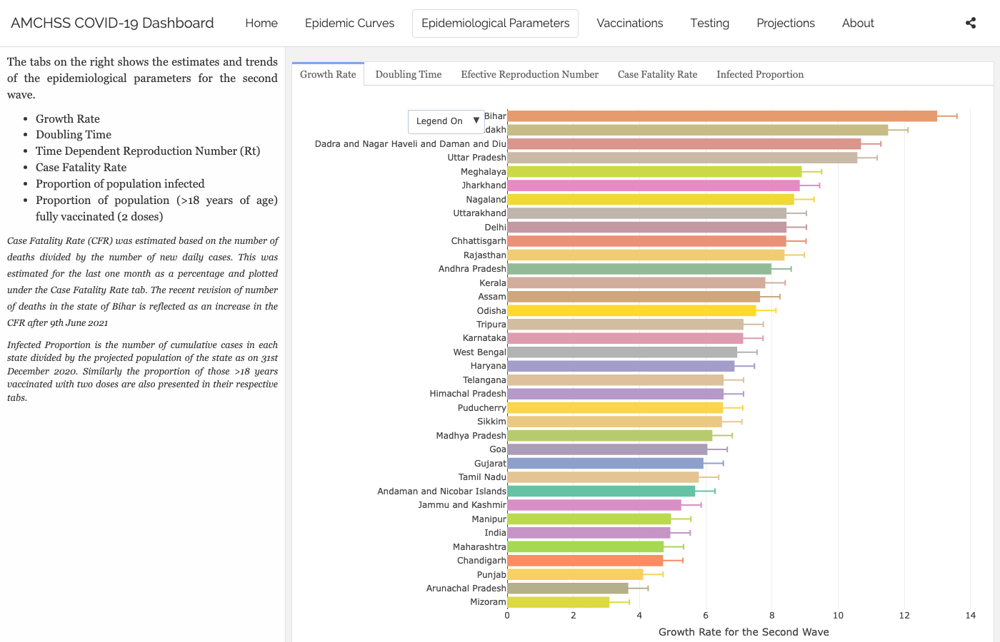
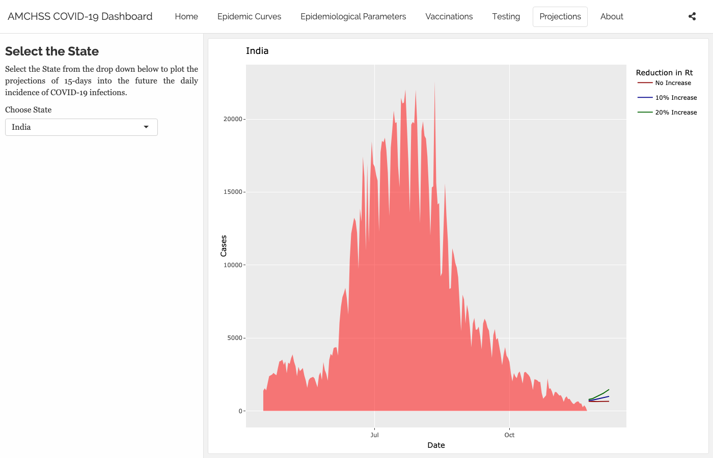

## What Is the AMCHSS Dashboard?

Built at **AMCHSS, SCTIMST Trivandrum** (Prof. Biju Soman's group). A live R + `flexdashboard` + `shiny` COVID-19 surveillance and modelling tool for India.

Five panels: **Home · Epidemic Curves · Epidemiological Parameters · Projections · About**.

<https://amchss-sctimst.shinyapps.io/covid_dashboard/>

::: {.notes}
Open it now in a browser. Keep PNG screenshots ready in case wifi fails.
:::

## How to Watch

For each panel, ask:

1. What question is it answering?
2. What input data does it need?
3. Which method from today sits behind it?
4. What's the uncertainty?

The handout has a 4-column table — fill it as we go.

## Panel 1 — Home {.smaller}

{fig-align="center" width="92%"}

Five value boxes (Confirmed · Active · Recovered · Deceased · % Active in last week), three map tabs (Deaths per 1000 · Active per lakh · % >18 yrs vaccinated), and a 14-day moving-average epicurve.

**From today**: descriptive epi + the line list → incidence → plot pipeline.

## Panel 2 — Epidemic Curves

<!-- TODO: insert PNG of Epidemic Curves panel showing state-level dygraph + wave-split fits -->

State selector → interactive `dygraphs` curve. The "First and Second Waves" tab overlays log-linear fits per wave.

The dashboard fits a log-linear `incidence::fit()` to each wave — same idea as our `glm(I ~ date, family = poisson())`.

::: {.notes}
Pick Kerala or Maharashtra. Show how the wave split snaps the same series into two distinct fits.
:::

## Panel 3 — Epidemiological Parameters {.smaller}

::: {.panel-tabset}

### Six tabs

- **Growth Rate** — log-linear `r` per state, 95% CI (Wave 2 default).
- **Doubling Time** — `log(2) / r`, same fits.
- **Effective R~t~** — 3D `plotly` ribbon, per state, over time.
- **Case Fatality Rate** — last 30 days, daily.
- **Infected Proportion** — cumulative cases / projected 2020 population.
- **Vaccinated Proportion** — % of >18 yr population fully vaccinated.

### R~t~ in detail

{fig-align="center" width="88%"}

Above: the *Growth Rate* tab (log-linear `r` by state, 95% CI). The *Effective R~t~* tab is a 3D `plotly` ribbon — best seen live.

Method: `R0::est.R0.TD()` — Wallinga & Teunis (2004) time-dependent R, gamma generation time (mean 4.4, sd 3 days), 95% bootstrap CI per state.

Same renewal-equation family as our Foundations demo. Different package (`R0` vs `EpiEstim`), different smoothing — same idea.

:::

::: {.notes}
Spend most time on the R~t~ tab. There are several R~t~ packages — EpiEstim (Cori), R0 (Wallinga–Teunis), EpiNow2 (Bayesian). Pick one, document your choice.
:::

## Panel 4 — Projections {.smaller}

{fig-align="center" width="92%"}

State selector → 15-day forward forecast of daily incidence using `projections::project()` — branching-process simulation seeded with the recent log-linear fit. The faint forecast lines at the right edge fan by assumed change in R~t~.

::: {.notes}
Forward projections are a tail of forecasts, not a single line. Ask: where's the uncertainty in this plot?
:::

## Panel 5 — About

Team at AMCHSS / SCTIMST. Methodology references (Mitra et al. 2020, PLOS ONE). Data attribution to covid19india.org.

A dashboard's *About* page is part of the methodology. Always read it.

## The Stack

- **R** — everything we did today.
- **`flexdashboard` + `shiny`** — single Rmd, multiple panels.
- **Daily ingest** from `api.covid19india.org`.
- **Analytics** — `incidence` for fits, `R0::est.R0.TD` for R~t~, `projections` for forecasts.
- **Geospatial** — `sf` + `mapview` + `leaflet`.
- **Hosting** — shinyapps.io free tier.

## What's in the Repo {.smaller}

```
amchss_covid_dashboard/
├── covid_dashboard.Rmd           # the flexdashboard
├── 1_analysis_code_run_sequence.R   # rebuild all RDS outputs
├── Rscripts/
│   ├── load_packages.R · load_data.R · tidy_data.R
│   ├── statewise_epidemiological_parameters.R   # R0, growth rate, doubling time
│   ├── statewise_projections.R · vaccine.R
│   └── homepage_fig1.R · value_boxes.R
├── data/   # state shapefiles, population
└── rds/    # pre-computed analytic outputs
```

**Pattern**: heavy compute → `.rds` cache → fast dashboard load. Fits run nightly; the dashboard reads the cached output.

## A Mini-Dashboard in 25 Lines {.smaller}

```{r}
#| eval: false
#| code-line-numbers: "|6-10|7|8|9|12-26|13|17-21|28"
library(shiny); library(flexdashboard); library(EpiEstim)
covid <- readr::read_csv(here::here("data", "covid_india_daily.csv")) |>
  dplyr::transmute(dates = date, I = as.integer(daily_confirmed))

ui <- fluidPage(                                                # <1>
  titlePanel("Mini R(t) Dashboard"),
  sliderInput("window", "Sliding window (days)", 3, 14, value = 7),  # <2>
  plotOutput("rt_plot")                                         # <3>
)

server <- function(input, output) {                             # <4>
  output$rt_plot <- renderPlot({                                # <5>
    n <- nrow(covid)
    rt <- estimate_R(
      incid  = covid,
      method = "parametric_si",
      config = make_config(list(
        mean_si = 4.7, std_si = 2.9,
        t_start = seq(2, n - input$window),                     # <6>
        t_end   = seq(2, n - input$window) + input$window
      ))
    )
    plot(rt, "R")
  })
}

shinyApp(ui, server)                                            # <7>
```

1. **UI** — what the user sees. Pure markup, no logic.
2. An **input** with `inputId = "window"` — the server reads it as `input$window`.
3. An **output slot** named `rt_plot` — paired with `output$rt_plot` in the server.
4. **Server** — the logic. Shiny re-runs the relevant blocks whenever any input they depend on changes.
5. The output ID (`rt_plot`) matches the UI slot — that's how Shiny wires them together.
6. The reactive read. This line *is* the dependency — when the slider moves, this expression re-evaluates and the plot updates.
7. One line ties UI and server together. Run this in RStudio and the app launches.

The AMCHSS dashboard is many of these, composed.

## Design Choices {.smaller}

- **Geography** — national or state? Aggregate hides heterogeneity; disaggregate adds noise.
- **Time window** — 7 days? 14 days? Affects R~t~ smoothness *and* delay.
- **R~t~ method** — Cori, Wallinga–Teunis, EpiNow2 — different smoothing, different uncertainty model.
- **Uncertainty display** — credible intervals, fan plots, or none?
- **What's not shown** — biases, data caveats, assumed serial interval. How would you surface these?
- **Audience** — public, journalists, policy-makers, clinicians?

::: {.notes}
Get one person to argue each side of the geography trade-off.
:::

## Where Did This Help?

- **Wave 2 (2021)** — real-time R~t~ informed state-level lockdown decisions.
- **Vaccine rollout** — coverage maps highlighted lagging districts.
- **Wave 3 (Omicron)** — fast doubling time made the Doubling Time tab the most-watched one.
- **Capacity planning** — 15-day projections fed ICU bed allocation.

A dashboard is **infrastructure**. The methods underneath it are what we taught today.

## What Would *You* Build?

In one sentence each:

- Disease?
- Audience?
- Single most important panel?

::: {.notes}
Lightning round. One sentence per person, no discussion.
:::
